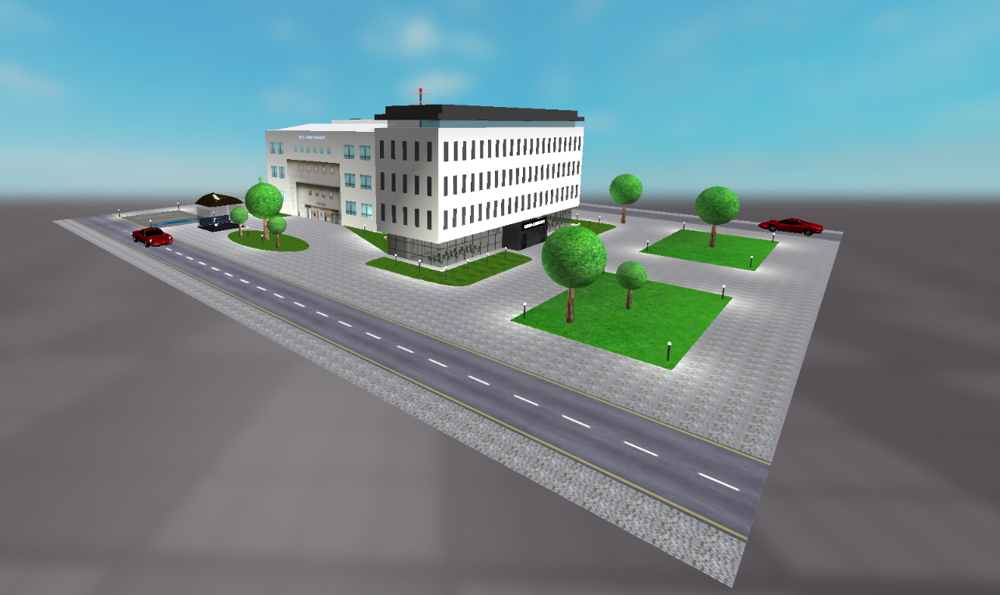
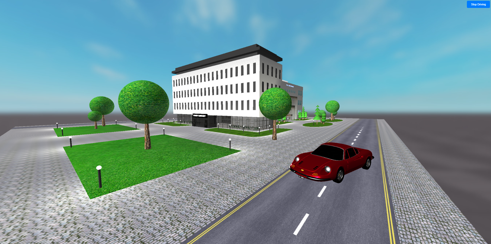
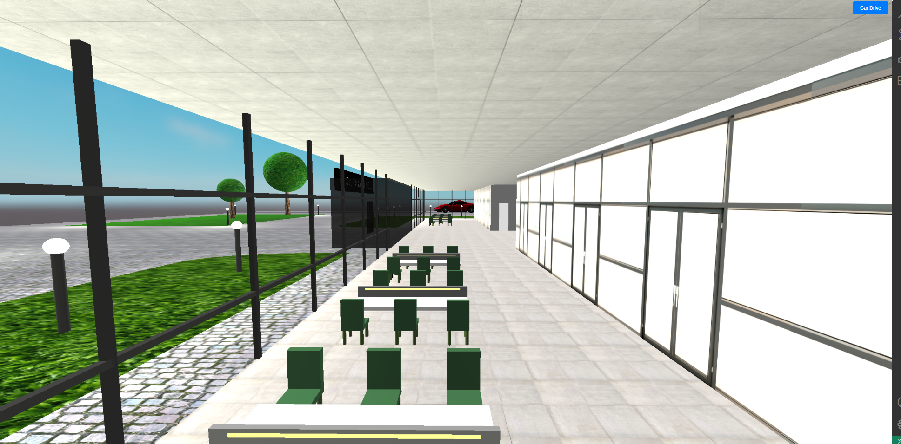
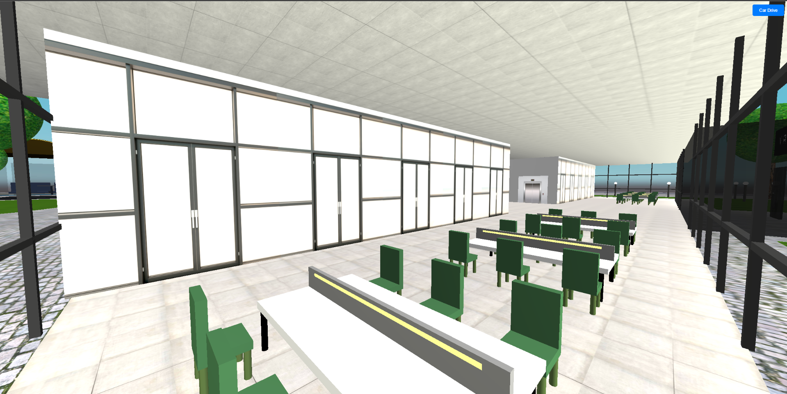
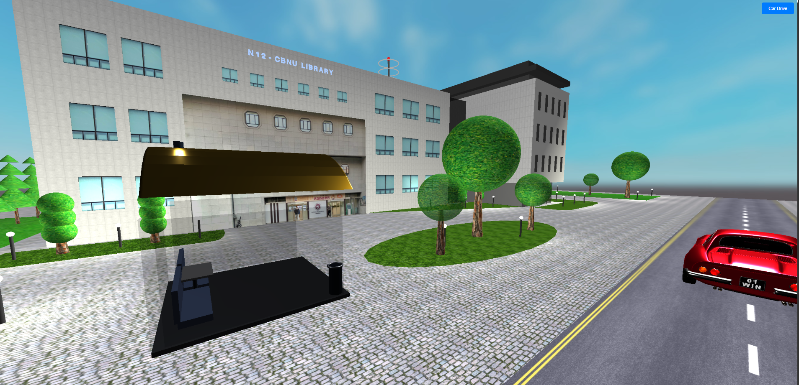
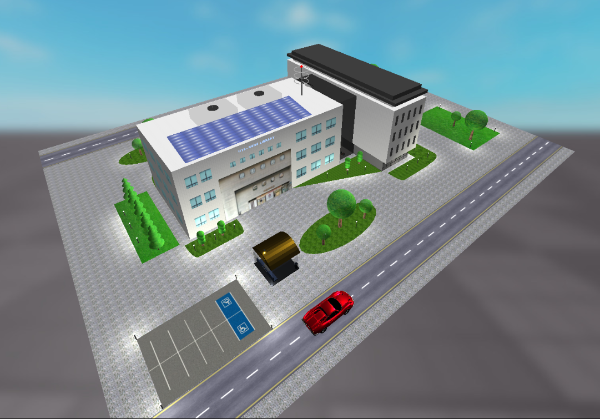
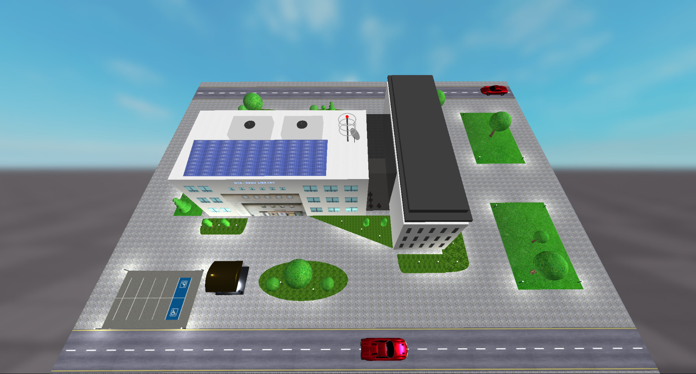

# 3D Chungbuk National University Library

This project visualizes a detailed 3D model of the **Chungbuk National University (CBNU) Library**, designed using the Three.js library. It features an interactive 3D environment that includes the external library building, interior details, surrounding elements, and additional animated and interactive features.

## Features

### Library Exterior
- **Building Architecture**: Realistic design of the library with textures for walls, windows, and doors.
- **Solar Panels**: Functional solar panel designs on the roof.
- **Antenna**: Communication antenna with a realistic design.
- **Surrounding Trees and Grass**: Varied tree designs and textured grass areas.
- **Smoking Zone**: A dedicated smoking area with detailed textures and objects.

### Library Interior
- **Desks and Chairs**: Detailed desks and chairs for students, including collaborative spaces.
- **Lighting**: Functional lights to enhance visibility and ambiance.
- **Rooms**: Separate rooms for group meetings and individual studies.

### Additional Features
- **Vehicles**: 
  - One animated vehicle moving along a predefined path.
  - One controllable vehicle using keyboard inputs (W, A, S, D keys).
- **Parking Area**: Dedicated parking zone with textures.
- **Interactive Navigation**: Camera controls for free exploration of the environment.
- **Realistic Materials**: High-quality materials for buildings, furniture, and outdoor elements.

## Key Technologies
- **Three.js**: 3D rendering and animation.
- **GLTFLoader**: Loading and displaying 3D models.
- **Texture Mapping**: Using textures for realism.
- **Custom Animations**: Smooth vehicle and smoke animations.
- **Lighting Effects**: Directional, ambient, and point lights for a dynamic scene.

## How to Use
1. Clone the repository:
   ```bash
   git clone <repository-url>
   ```
2. Navigate to the project directory:
   ```bash
   cd cbnu-library
   ```
3. Open the `index.html` file in a browser to view the 3D environment.

## Controls
- **Camera**: Use the mouse and scroll to navigate around the scene.
- **Controllable Vehicle**: Use `W`, `A`, `S`, `D` keys to move the vehicle.
- **Buttons**: Start/stop the controllable vehicle using the "Car Drive" button.

## Project Gallery

### Exterior View
_Description: Showcase of the library's exterior, including trees, grass, and building textures._
<div style="display: flex; gap: 10px; flex-wrap: wrap;">
  
  
</div>

### Interior Design
_Description: View of the desks, chairs, and lighting within the library._
<div style="display: flex; gap: 10px; flex-wrap: wrap;">
  
  
</div>

### Smoking Zone
_Description: Smoking zone setup with detailed elements._
<div style="display: flex; gap: 10px; flex-wrap: wrap;">
  
</div>

### Parking Area
_Description: Dedicated parking space with animated vehicles._
<div style="display: flex; gap: 10px; flex-wrap: wrap;">
  
</div>

### Rooftop Features
_Description: Solar panels and antenna on the library's rooftop._
<div style="display: flex; gap: 10px; flex-wrap: wrap;">
  
</div>

## Credits
- **3D Models**: Created with GLTFLoader and custom designs.
- **Textures**: Custom textures for building, grass, and other elements.
- **Development**: Abbos Aliboev


## License
This project is licensed under the MIT License.

---

Feel free to explore the interactive environment and contribute to the project!
